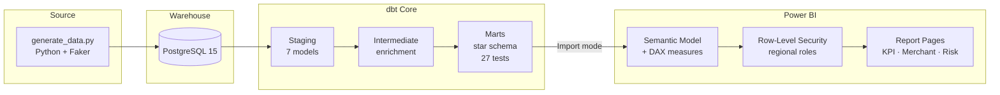

# Embedded Finance Unit Economics Dashboard

A BI portfolio project that mirrors what a European card-payments processor
(Paynetics, Payhawk, Revolut BG) runs internally: raw transaction data →
a tested dbt transformation layer → a Power BI semantic model with
row-level security, time intelligence, and drillthrough.

Built on a synthetic but
realistically-calibrated card-transaction dataset (50,000 transactions,
100 merchants, 700 cards, across 6 European markets).

## Architecture



## Tech stack

| Layer | Tools |
|---|---|
| Data generation | Python, Faker, psycopg2 |
| Warehouse | PostgreSQL 15 (Docker) |
| Transformation | dbt Core 1.8, SQLFluff |
| BI | Power BI Desktop (PBIP format), DAX Studio, Tabular Editor 2 |
| Version control | Git / GitHub |

## What's worth looking at

A few decisions in this project are deliberate, not defaults — see
[`docs/DECISIONS.md`](docs/DECISIONS.md) for the full reasoning behind each:

- **Import over DirectQuery** — static synthetic data, full DAX surface,
  no reason to pay DirectQuery's feature restrictions.
- **Surrogate keys everywhere, never names, for joins or grouping** —
  the project has a live example of why: two distinct merchants
  independently generated with the identical name "Ortega Inc."
- **Row-level security modeled on a real org structure** — regional
  country-manager roles (a Bulgaria manager sees only Bulgarian merchants)
- **A genuine data-quality bug hunt** — the first data generation produced
  fraud losses at 50–100% of transaction value, large enough to push whole
  months of net revenue negative. Root-caused and fixed by bounding loss
  magnitude to 5–20% of transaction amount; documented with before/after
  numbers in the decisions log.

## Repository structure

```
├── sql/analysis/              # Phase 1 — raw analytical SQL (window functions,
│                               #   period-over-period, etc.)
├── fintect_dbt/                # Phase 2 — dbt project
│   ├── models/staging/
│   ├── models/intermediate/
│   └── models/marts/           # star schema: fct_transactions + 6 dims
├── powerbi/                    # Phase 3 — Power BI project (PBIP format)
│   └── fintech-dashboard.SemanticModel/
├── generate_data.py             # synthetic data generator
├── docs/
│   └── DECISIONS.md            # architecture decision record
├── PROJECT_PLAN.md             # phase-by-phase build plan and status
└── LEARNING_LOG.md             # session-by-session concept notes
```

## Data model

Star schema: `fct_transactions` (50K rows) at transaction grain, with six
dimensions — `dim_merchant`, `dim_customer`, `dim_card`, `dim_bank`,
`dim_scheme`, `dim_date`. Net revenue, fraud, and chargeback logic are
defined once at the fact grain and referenced everywhere downstream —
in dbt models, in Power BI DAX measures, and in the 27 dbt tests that
guard the pipeline (uniqueness, not-null, accepted values, and
relationship/orphan checks on every foreign key).

## Running it locally

1. **Start Postgres** — `docker run --name fintech-db -e POSTGRES_PASSWORD=admin123 -e POSTGRES_USER=analyst -e POSTGRES_DB=fintech -p 5432:5432 -d postgres:15`
2. **Generate data** — `python generate_data.py` (requires `faker`, `psycopg2-binary`)
3. **Build the dbt layer** — `cd fintect_dbt && dbt build`
4. **Open the Power BI report** — `powerbi/fintech-dashboard.pbip` in Power BI Desktop, set the Postgres connection, refresh

## Status

Phases 1 (data foundation) and 2 (dbt) are complete. Phase 3 (Power BI) has
a working semantic model, full DAX measure set (core + time intelligence),
three report pages, drillthrough, and row-level security — a final
formatting/layout pass is the one remaining item. See
[`PROJECT_PLAN.md`](PROJECT_PLAN.md) for the full phase-by-phase status.
